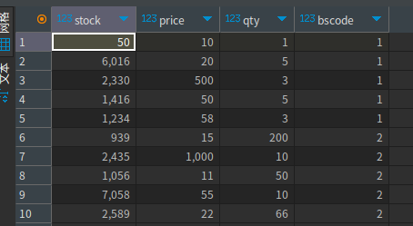
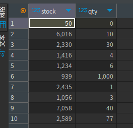
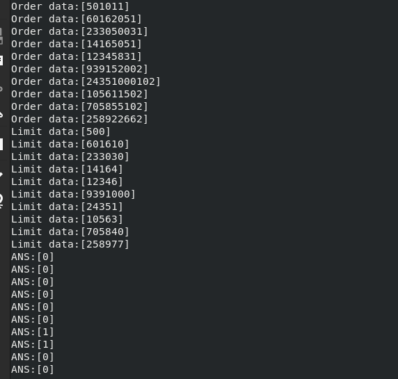

# 報告

## 委託


## 股票庫存


## HLS

```c++
#include <ap_int.h>
#include <hls_stream.h>
#include <iostream>
#include <stdio.h>
using namespace hls;

#define stock_len 14
#define qty_len 14
#define price_len 20
#define bs_len 2
#define order_len stock_len + qty_len + price_len + bs_len

typedef ap_uint<order_len> order_t;
typedef ap_uint<stock_len> stock_t;
typedef ap_uint<qty_len> qty_t;
typedef ap_uint<price_len> price_t;
typedef ap_uint<bs_len> bs_t;

// 預設最大處理數量
const int customers_max = 50;

// 讀取客戶資料
static void read_input(order_t *customer_data, hls::stream<order_t> &inStream, int number_of_customer);

// 判斷資料
static void compare(int *initdata, hls::stream<order_t> &inStream, hls::stream<int> &outStream, int number_of_customer);

// 回傳對應的結果
static void write_result(int *customer_ans, hls::stream<int> &outStream, int number_of_customer);

extern "C"
{
    void riskcontrol(order_t *customer_data, int *customer_ans, int customers_number);
}
```

```c++
#include "hls.hpp"
#include <ap_int.h>
#include <hls_stream.h>
using namespace hls;

// 讀取客戶資料
static void read_input(order_t *customer_data, hls::stream<order_t> &inStream, int number_of_customer)
{
mem_rd:
    for (int i = 0; i < number_of_customer; i++)
    {
#pragma HLS LOOP_TRIPCOUNT min = customers_max max = customers_max
        inStream << customer_data[i];
    }
}

// 判斷
static void compare(int *initdata, hls::stream<order_t> &inStream, hls::stream<int> &outStream, int number_of_customer)
{
execute:
    int money = 0;
    for (int i = 0; i < number_of_customer; i++)
    {
#pragma HLS LOOP_TRIPCOUNT min = customers_max max = customers_max
        order_t order = inStream.read();
        stock_t tempstock = order(stock_len + price_len + qty_len + bs_len - 1, price_len + qty_len + bs_len);
        price_t tempprice = order(price_len + qty_len + bs_len - 1, price_len);
        qty_t tempqty = order(qty_len + bs_len - 1, qty_len);
        bs_t tempbs = order(bs_len - 1, 0);
        money = tempqty * tempprice;
        if (i == 0)
            printf("dataassign i=%d 資料: [%d] stock: [%d] price: [%d] qty: [%d] bs: [%d]\n", i, order, tempstock, tempprice, tempqty, tempbs);

        if (tempbs == 1)
        { // 買單檢查額度
            if (5000000 < money)
                outStream.write(1);
            else
                outStream.write(0);
        }
        else
        { // 賣單檢查庫存
            if (initdata[i] < tempqty)
                outStream.write(1);
            else
                outStream.write(0);
        }
    }
}

// 回傳對應的結果
static void write_result(int *customer_ans, hls::stream<int> &outStream, int number_of_customer)
{
mem_wr:
    for (int i = 0; i < number_of_customer; i++)
    {
#pragma HLS LOOP_TRIPCOUNT min = customers_max max = customers_max
        customer_ans[i] = outStream.read();
    }
}

extern "C"
{
    void riskcontrol(order_t *customer_data, int *customer_ans, int customers_number)
    {
#pragma HLS INTERFACE m_axi port = customer_data bundle = gmem0 depth = 32
#pragma HLS INTERFACE m_axi port = customer_ans bundle = gmem0 depth = 32
        static hls::stream<order_t> customers_in("input_stream");
        static hls::stream<int> customers_out("output_stream");
        int initdata[] = {0, 10, 30, 4, 6, 1000, 1, 3, 40, 77};
#pragma HLS STREAM variable = customers_in depth = 32
#pragma HLS STREAM variable = customers_out depth = 32

#pragma HLS dataflow
        read_input(customer_data, customers_in, customers_number);
        compare(initdata, customers_in, customers_out, customers_number);
        write_result(customer_ans, customers_out, customers_number);
    }
}
```


## 圖片




