# Vitis HLS Demo

[線上計算機](<https://matrixcalc.org/zh-TW/#%7B%7B0,1,2,3%7D,%7B4,5,6,7%7D,%7B8,9,10,11%7D,%7B12,13,14,15%7D%7D*%7B%7B0,1,2,3%7D,%7B4,5,6,7%7D,%7B8,9,10,11%7D,%7B12,13,14,15%7D%7D>)


多維的矩陣乘法，是一個很好驗證的題目，我就拿這個例子說明吧

首先要有 3 種檔案 matrix_mul.cpp matrix_mul.h 和 main.cpp 前面 2 個是用來實現矩陣乘法的程式碼後面的是用來驗證的

跑完後在針對產生的報告去做分析跟優化

## 報表說明

C Synthesis 報表會有這些
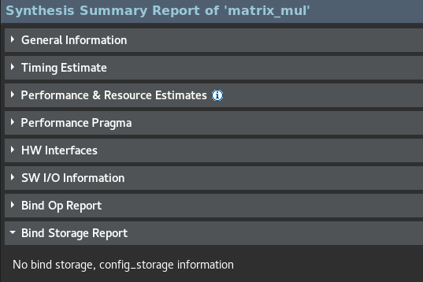

General Information 部分呈現 project 名稱，solution 名稱和具體的裝置型號

Timing Estimate 部分則是展示了目標時脈頻率和預估時脈頻率

Performance & Resource Estimates 是報告的重點部分
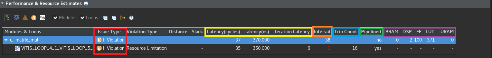

從 Performance 角度看，顯示了每個函數或循環的 Latency 以及整個設計的 Latency, 圖中黃色方框

也有顯示相對應的 II (Initial Interval), 圖中红色方框

對於循環，还能看到循環次數 (Trip Count), 圖中藍色方框
無論是函數還是循環，是否使用了 Pipeline, 會以 no 或 yes 來表示，圖中綠色方框

從 Resource 角度看，報告會呈現主要資源如 BRAM/URAM、DSP、 LUT 和 FF 的使用量，圖中紫色方框

如果 C Synthesis 之後，無論是 Performance 还是 Area 不能達到預期目標，會给出違例類型，圖中红色方框出現 II 違例


```txt
Loop Latency: 完成所有循環需要的時脈頻率
Iteration Latency: 循環里面，迭代一次需要的周期
Initiation Interval (II): 兩次迭代之間的頻率
Trip Count: 循環次數
```

HW Interfaces 會顯示生成的 RTL 代碼頂層對外接口，包括頂層控制接口，如 ap_rst、ap_start、ap_done、ap_ready 等，如下圖

```txt
控制端口用來控制和顯示該模組的工作狀態
各個端口的功能如下，默認情況下會生成下面四個控制端口
ap_start (in): 為高電位時，該模組開始處理資料
ap_done (out): 為高電位時，表示模組處理資料完成
ap_idle (out): 說明模組是不是處在空閒狀態。為高電位時，處於空閒狀態
ap_ready (out): 為高電位時，表示模組可以接受新的資料
``` 

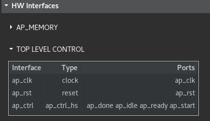

SW I/O Information 部分除了顯示頂層 C 函數的參數信息外，還會顯示參數與生成的 RTL 代碼輸入 / 輸出的對應關係，如下圖

```txt
參數 d_o，d_i 是 Array 類型，默認狀態下會生成記憶體的接口
記憶體接口的資料來自外部的 memory，通過地址訊號讀取相應的資料，輸入到該模組中。輸入 Array 從外部記憶體中讀取資料，輸出 Array 把資料寫給外部記憶體
各個端口的定義如下
address: 地址信號 ce0: 片選信號 (chip select) we0: 寫信號 (write enable) d0: 資料信號
```

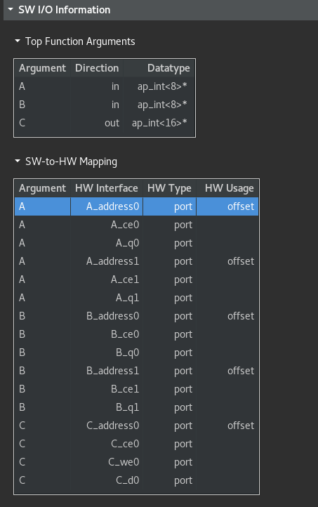

Bind Op Report 則會顯示設計中的一些算術運算，涉及浮點數的運算以及消耗 DSP 的運算的實現形式，如下圖

圖中 op 列表示運算類型

圖中 Impl 列表示實現方式，這裡的 fabric 就說明使用的是 SLICE 裡的資源實現的

圖中 Latency 列則是該運算輸入到輸出的時脈頻率個數

從這個報告中包含 Op 的每一行都可以到 C 程式碼中，就可以清晰地看到 Op 與 C 程式碼的對應關係

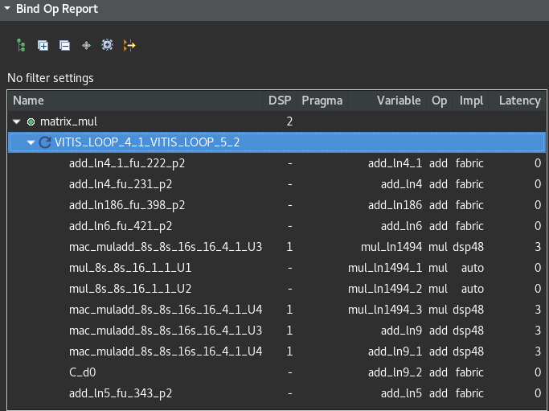

Bind Storage Report 則會顯示設計中的 Array 在轉成 RTL 代碼後的具體實現方式，是採用 LUTRAM、BRAM 還是 URAM

## 優化環節

行列相乘部分，行列相乘後相加的代碼，我们希望只用一個時脈就算出來有兩種方法
1. unroll，手動展開循環 針對最後一個 Loop 展開
2. pipline，系统自動展開 針對第 2 個 Loop
    - partiotion，切分 Array
    - reshape，改變存儲長度

Source File 是把參數放在 C 程式碼中，Directive File 是把參數單獨放在一個程式碼中，一般用 Source File 就行了

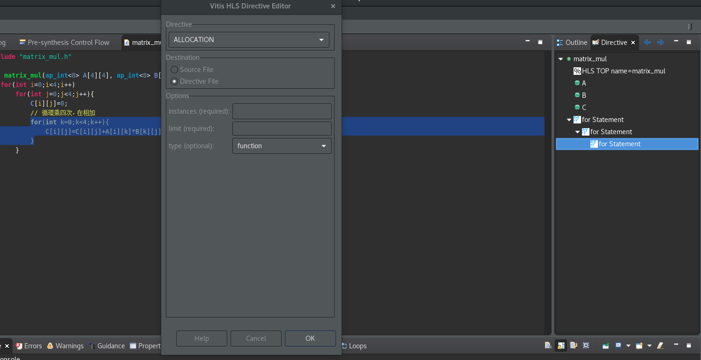

法一：對最後的 Loop 做展開

每次都需要 4 個加法跟 1 個賦直復職 所以 col 的總延遲是 5 * 4 = 20

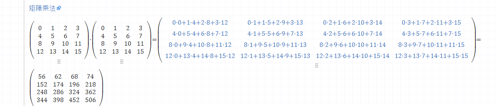

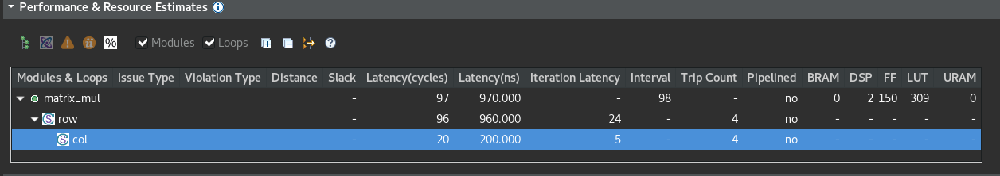

法二：對第 2 個 Loop 優化

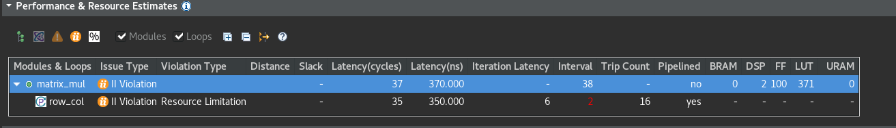

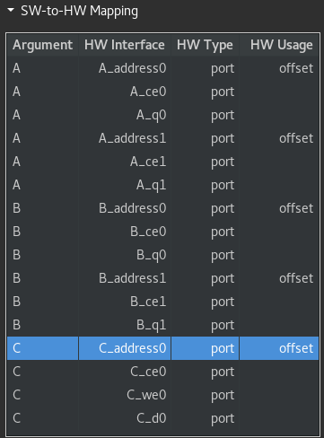

端口只有 ce0 和 ce1:

當沒有去設定 Array A 和 Array B 的端口類型，默認是雙端口
讀取資料時一次只能讀 2 個，所以 16 次計算，理論上每次讀取 4 個資料需要 16*4 的 64 次數 64/2=32 個週期 但是這邊顯示是 35 個週期

所以需要優化 Array 的設定，同時取出 4 個資料，可以通過 ArrayPartition 和 ArrayReshape 實現 Array_Partition 陣列分割，A 豎著切割 (按照维度 2)，分成 4 份分别存在 4 個存儲器里面，B 横著切割 (按照维度 1) 分别存在 4 個存儲器里面，計算同時各取出 4 個然後運算

這是用 ArrayPartition 來實現

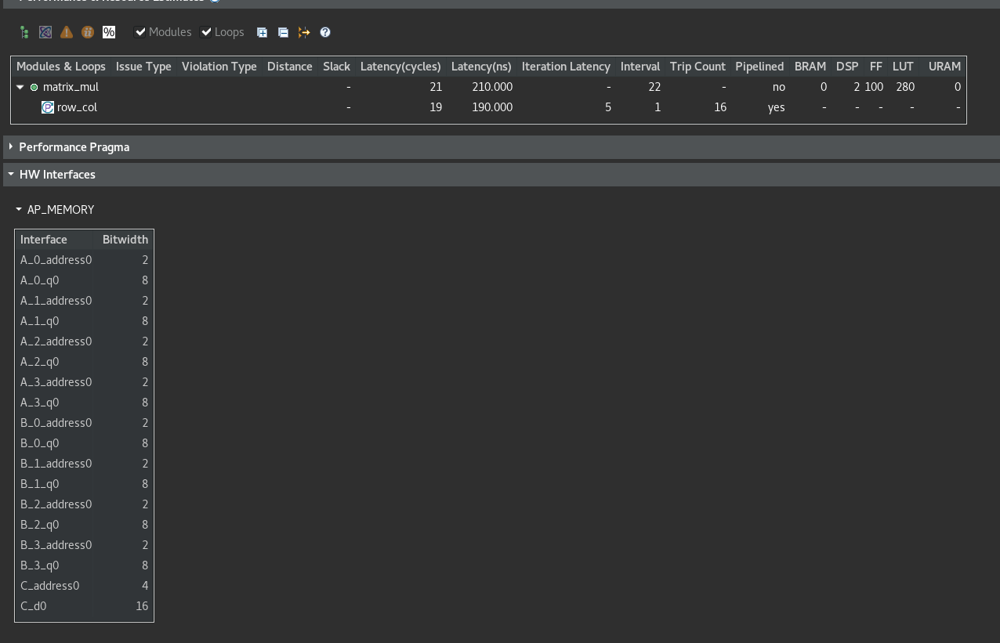

這是用 ArrayReshape 來實現

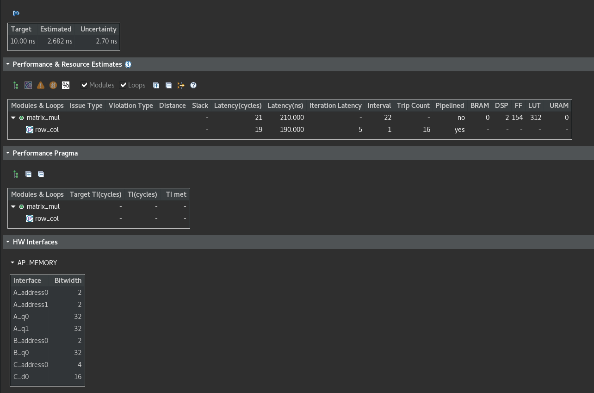

array_reshape 和 array_partion 都提高了一個頻率内可以讀取的陣列資料
也都支持相同的操作，可以循環和阻塞分組或者根據多維度的資料來做不同維度的分組
在使用 array_reshape 的時候，所有的元素在變換後的 Array 中共用同一個地址，array_reshape directive 會形成大的存儲塊，這減少了所消耗的塊 RAM 的數量，同時提供了分區的主要好處：並行處理，但是 array_partition 變換後 Array 中地址是不相關的，可能會占用很多存儲器

## 更複雜的優化方法

把大矩陣拆分成一塊一塊的小矩陣做運算在整合

# Vivado Demo

先想辦法開啟 vivado, 然後新建專案，接著按 PROJECT MAMAGER 的 Setting 裡面有個 IP 點 Repository 把 Vitis HLS 的專案加進來

然後按 OK 退回主畫面去點 Create Block Design 按 + 的符號 搜尋 Processing System 加入然後記得按 Run Connection Automation 連線在把我們寫的 IP 匯入 然後再按 Run Connection Automation 自動接線 接完後按圖示上的確認 沒問題後去 Sources 打包 (Creatr HDL Wrapper)


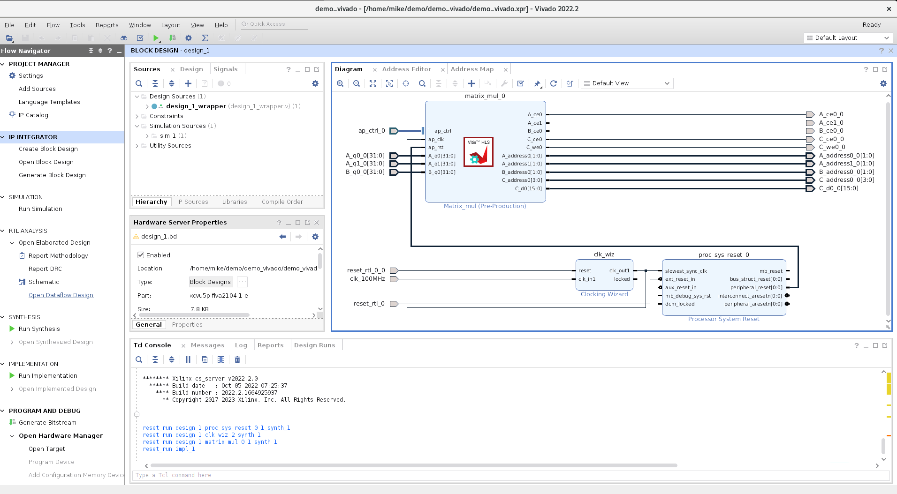
