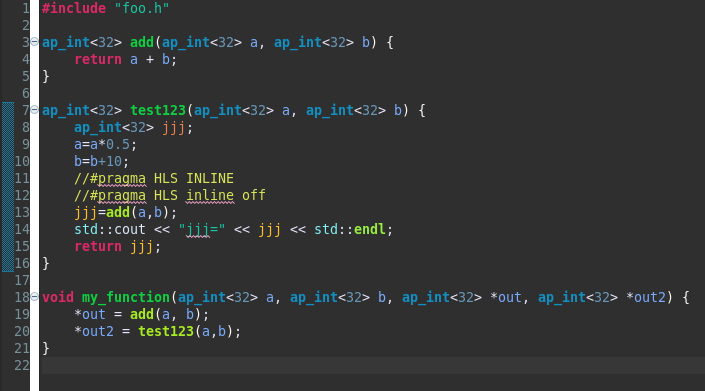
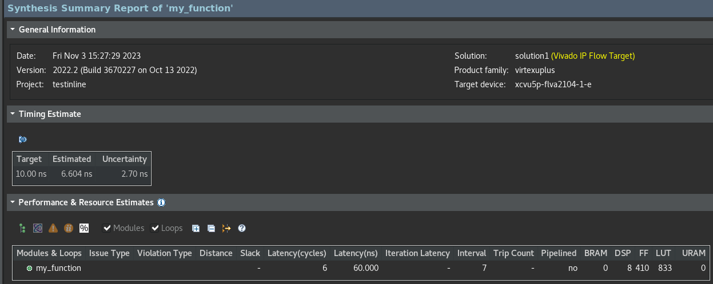
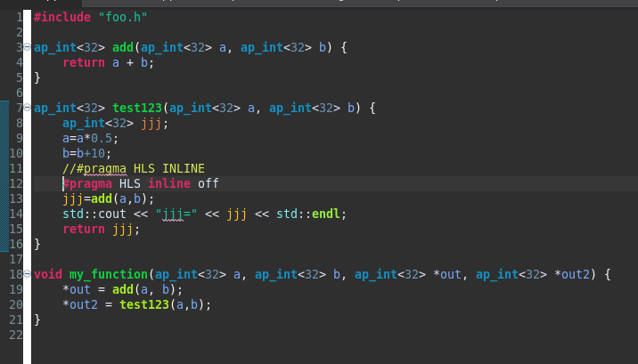
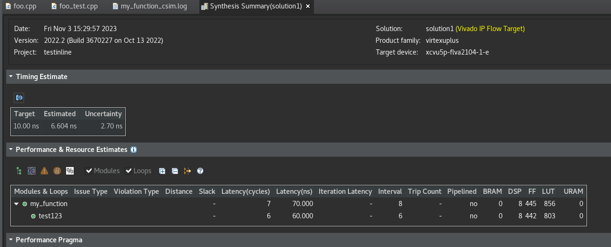

# HLS 函數

頂層函數綜合後就會變 RTL 設計的頂層模組, 綜合後, 設計中每個函數都有自己的綜合報告和 HDL 文件(Verilog 和 VHDL)

重要: Top Function 不得用靜態函數

## 內聯函數 (內嵌函式)

在軟體的定義: [微軟連結](https://learn.microsoft.com/zh-tw/cpp/cpp/inline-functions-cpp?view=msvc-170)

```txt
inline 關鍵字會指示編譯器針對函式呼叫的每個執行個體，取代函式定義內的程式碼。

使用內嵌函式可以讓程式更快速，因為它們不需要與函式呼叫相關聯的負荷。 編譯器可以透過無法供一般函式使用的方式，將擴充的函式優化。

內嵌程式碼替代會在編譯器的任意時間進行。 例如，如果建置函式的位址太大而無法內嵌，則編譯器不會內嵌函式。

類別宣告主體中定義的函式隱含為內嵌函式。

簡單說就是加速就對了
```

在 HLS 裡面: 
下面範例會呼叫 foo() 3 次 但是加上這段 #pragma HLS ALLOCATION instances=foo limit=1 function
把函數 foo_sub 内聯並使用 ALLOCATION 指令只使用 foo 函數的 1 個實例, 這要生成的設計只會有 1 個 foo 函數的實例
面積就會是優化前的 3 分之 1, 使用此方法可以減少更多資源

```c++
foo_sub (p, q) {
    int q1 = q + 10;
    foo(p1,q); // foo_3 呼叫 3 次
}
void foo_top { a, b, c, d} {
    #pragma HLS ALLOCATION instances=foo limit=1 function
    ...
    foo(a,b); // foo_1 呼叫 1 次
    foo(a,c); // foo_2 呼叫 2 次
    foo_sub(a,d);
    ...
}
```

### 甚麼都沒加



### 關掉INLINE




## 函數的流水拍打

請看常用名詞的重要指令說明

## 函數例化

函數例化是一種最佳化技巧, 不僅可以維持函數層級的面積優勢, 還可以提供另一個強大選項
在函數的特定例子上針對性局部最佳化 可以減化函數調用的控制邏輯, 也可能改進延時和吞吐量


FUNCTION_INSTANTIATE 編譯指令可簡化周圍控制結構, 並且產生最優化的, 更小的函數模組

```c++
char func(char inval, char incr) {
    #pragma HLS INLINE OFF
    #pragma HLS FUNCTION_INSTANTIATE variable=incr
    return inval + incr;
}
 
void top(char inval1, char inval2, char inval3, char *outval1, char *outval2, char *outval3)
{
    *outval1 = func(inval1,   0);
    *outval2 = func(inval2,   1);
    *outval3 = func(inval3, 100);
}
```

如果在沒有大幅度内聯或是代码修改的情况下, 在不同層級使用該函數而導致函數難以共享, 那麼函數例化可提供改進面積的最佳方法

大量小型局部最佳化的副本比大量無法共享的大型副本更有效

## 資料類型

重要 Vitis HLS 不支援 32 位元, std::complex<long double>也不支持, 在定義#define 名稱的時候 不要用其他 Lib 會用的名字怕衝突名字 (#define _TYPES_H 就盡量不要)

資料類型會影響精確度跟存儲器要求, 也會影響綜合後的 RTL 現實中的面積和性能

Vitis HLS 支持標準 C/C++ 類型進行综合, 包括精確寬度的整數類型

- (unsigned) char and (unsigned) short and (unsigned) int
- (unsigned) long and (unsigned) long long
- (unsigned) intN_t（N 是 8 16 32 64，在 stdint.h 中定義）
- float and double

AMD 是建議再一個公用的標頭檔定義所有變數的類型

AMD 的意思是這樣比較方便調整, 萬一要調整面積大小 要動到變數的時候比較方便

## 標準類型

[資料寬度](https://learn.microsoft.com/zh-tw/cpp/cpp/data-type-ranges?view=msvc-170)

```c++
標頭檔的定義
typedef char din_A; // 1 Bytes = 8 bit
typedef short din_B; // 2 Bytes = 16 bit
typedef int din_C; // 4 Bytes = 32 bit
typedef long long din_D; // 8 Bytes = 64 bit

typedef int dout_1; // 4 Bytes = 32 bit
typedef unsigned char dout_2; // 1 Bytes = 8 bit
typedef int32_t dout_3; // 4 Bytes = 32 bit
typedef int64_t dout_4; // 8 Bytes = 64 bit

void types_standard(din_A inA, din_B inB, din_C inC, din_D inD, dout_1 *out1, dout_2 *out2, dout_3 *out3, dout_4 *out4);

#include "types_standard.h"

void types_standard(din_A inA, din_B inB, din_C inC, din_D inD, dout_1 *out1, dout_2 *out2, dout_3 *out3, dout_4 *out4)
{
    // Basic arithmetic operations
    *out1 = inA * inB; 輸出是 32 bit 的資料, 乘法器是 8+16=24 bit, 會自動擴展變 32 bit 跟輸出一樣
    *out2 = inB + inA; 輸出是 8 bit 的資料, 加法器是 short 16 位裡的 8 + char 的 8 = 8 bit
    *out3 = inC / inA; 輸出是 32 bit 的資料, 會把 inA char 擴成 32 bit 再來做除法 inC 本來就 32 bit 不用動
    *out4 = inD % inA; 輸出是 64 bit 的資料, 會把 inA char 擴成 64 bit 再來處理
}
```

結論就是:
在加法來說 當輸出的寬度比輸入的還大的時候 可以用最小運算, 當輸出的寬度比輸入的還小的時候 還是可以運算
在減法來說 會需要先擴充到完整對應的大小才能做運算

## 浮點數和雙精度

- 單精度 32 位 (4 Bytes)
24 位小數
8 位指數
- 雙精度 64 位 (8 Bytes)
53 位小數
11 位指數

[說明](https://docs.xilinx.com/r/zh-CN/ug1399-vitis-hls/%E6%B5%AE%E7%82%B9%E4%B8%8E%E5%8F%8C%E7%B2%BE%E5%BA%A6)

## 浮點累加器和 MAC

不是很了

## 複合資料類型

HLS 支持對以下類型作綜合
1. struct
2. enum
3. union

### struct 的情況

程式碼中的 struct 默認情況下是解聚 (disaggregated) 狀態
這些 struct 解聚為對應每個變數的獨立對象 建立的數量和類型取決於 srtuct 本身的内容
假設: srtuct array 當多個陣列來實現, 每個 srtuct 成員都具有獨立的陣列

```c++
typedef struct {
    unsigned short varA; // 2 Bytes = 16 bit
    unsigned char varB[4]; // 1 Bytes = 8 bit
} data_t;

data_t struct_port(data_t i_val, data_t *i_pt, data_t *o_pt);

在接口上聚合 struct 會有單個 48  bit 端口(16+32=48), 其中包含 16 bit 的 varA 和 4x8 bit 的 varB。
```

### C++的類別和模板

他這邊提供了一個濾波器的範例 示範對運算符號重載跟類別, 模板的程式碼 我有放在 192.168.199.2 上

AMD 不建議使用全域變數, 會對最佳化指令有影響, 導致不能最佳化

越來越天書了...

模板的範例: 用模板來做遞迴的斐氏數列

因為 HLS 不支持遞迴函數可以使用 C++ 的模板來綜合

每次都遞迴 5 次 然後都是獨立的 詳細在 192.168.199.2

### enum

沒差 省略

### union

HLS 綜合並不保證使用相同的内存或者暫存器

## 類型限定詞

- volatile 綜合不會進行優化

- static 1. RTL等價是暫存器 觸發器 内存 2. config_rtl 需要設定, 不然默認復位不會初始化

- const 常量或者 ROM

## 任意精確度 (AP) 資料類型優點

C/C++ 的原生資料類型都在 8 位邊界(8 位, 16 位, 32 位和 64 位)上 但是，RTL (對於硬體)支持任意資料長度 標準 C/C++ 資料類型可能導致硬體實現效率不好
例如: AMD 中的基本乘法單位是 DSP 庫單元 32 位"ints"整數乘法需要多個 DSP 單元, 而使用任意精度類型則可以每次乘法只使用一個單元

任意精度 (AP) 資料類型會讓程式碼使用寬度更小的變數, C/C++ 仿真階段還不會受影響, 比較小的寬度生的硬體運算會更小更快, 這樣在 FPGA 中可以部屬更多邏輯, 並且也允許用更高的時脈來處理

AP 資料類型的缺點之一是 Array 不會以 0 自動初始化 如果要初始化 Array 要手動執行

範例: 我有寫在192.168.199.2 (aptype) 會有跟原生的型態有比對 反正就是比較快

## 任意整數的資料類型

| 語言 | 資料類型 | 要的標頭檔 |
| :----: | :----: | :----: |
| C++ | ap_[u]int<W> (1024 bit) 可以拓展到 4096 bit | #include "ap_int.h" |
| C++ | ap_[u]fixed<W,I,Q,O,N> | #include "ap_fixed.h" |

| 符號 | 意義 |
| :----: | :----: |
| W | 寬度 |
| I | 整數的位數, 隱含正負號 |
| Q | 量化模式：規定當生成的精準度大於儲存的變數中的最小小數位數的行為 反正就是小數位數大於要存的變數小數位數啦 |
| O | 上溢模式：規定運結果大於儲存變數的最大值的行為 就是超過要存的變數的極值 int64 放到 int32 |

| 量化模式 | 描述 |
| :----: | :----: |
| AP_RND | 捨入到正無窮 |
| AP_RND_ZERO | 捨入到 0 |
| AP_RND_MIN_INF | 捨入到負無窮 |
| AP_RND_INF | 捨入到無窮 |
| AP_RND_CONV | 收斂捨入 |
| AP_TRN | 截位到負無窮(預設) |
| AP_TRN_ZERO | 截位到 0 |
| 上溢模式 | 描述 |
| :----: | :----: |
| AP_SAT | 飽和 |
| AP_SAT_ZERO  | 飽和到 0 |
| AP_SAT_SYM  | 對稱飽和 |
| AP_WRAP | 捲繞(預設) |
| AP_WRAP_SM | 正負符號捲繞 |

```c++
#include "ap_int.h"

// 如果要到4096 可以用AP_INT_MAX_W來定義 預設是1024 但是數字越大 編譯跟執行的時間就會變久
#define AP_INT_MAX_W 4096
ap_int<9> var1; // 9-bit
ap_uint<10> var2; // 10-bit unsigned
```

## 任意浮點數的資料類型

```c++
#include <ap_fixed.h>

ap_fixed 類型用來定義 18 位變數, 其中 6 位(包含正負號)指定為表示小數點前的數字, 剩下 12 位則是小數點後的值 (都是用2進位表示)
ap_fixed<18,6,AP_RND> t1 = 1.5; // internally represented as 0b00'0001.1000'0000'0000 (0x01800)
ap_fixed<18.6,AP_RND> t2 = -1.5; // 0b11'1110.1000'0000'0000 (0x3e800)

```

[複習一下](https://kknews.cc/zh-tw/invest/qlm8m4g.html)

## 指標

指標在 C/C++ 中可以用, 也支持综合, 但他們建議避免使用指標 在以下情況下使用指標時候更是如此:

- 在同一函數内多次訪問(讀取或寫入)指標 (陣列那邊有講過)
- 使用指標陣列, 每個指標都必須指向 1 個純量或純量阵列(而不是另一指標)
- 只支持標準 C/C++ 間的指標强制轉換

[指標範例](https://github.com/Xilinx/Vitis-HLS-Introductory-Examples/tree/master/Modeling/Pointers)

一些例子:

1. 指標指向多個對象

```c++
dout_t pointer_multi (sel_t sel, din_t pos) {
    static const dout_t a[8] = {1, 2, 3, 4, 5, 6, 7, 8};
    static const dout_t b[8] = {8, 7, 6, 5, 4, 3, 2, 1};
    dout_t* ptr;

    if (sel)
        ptr = a; 
    else
        ptr = b;

    return ptr[pos];
} 
```

2. HLS 有支援雙指標(應該也不常用), 但是頂層函數沒有支持, 簡易是不要用太多, 會增加執行的時間

```c++
data_t sub(data_t ptr[10], data_t size, data_t**flagPtr)
{
    data_t x, i;

    x = 0;
    // Sum x if AND of local index and pointer to pointer index is true
    for(i=0; i<size; ++i)
        if (**flagPtr & i)
            x += *(ptr+i);
    return x;
}

// 這邊不能用雙指標
data_t pointer_double(data_t pos, data_t x, data_t* flag)
{
    data_t array[10] = {1, 2, 3, 4, 5, 6, 7, 8, 9, 10};
    data_t* ptrFlag;
    data_t i;

    ptrFlag = flag;

    // Write x into index position pos
    if (pos >=0 & pos < 10) 
        *(array+pos) = x;

    // Pass same index (as pos) as pointer to another function
    return sub(array, 10, &ptrFlag);
}
```

3. 指標陣列也是可以用的, 注意指標只能只到純量或是陣列, 不能再指給其他指標

```c++
data_t A[N][10];

data_t pointer_array(data_t B[N*10]) {
    data_t i,j;
    data_t sum1;

    // Array of pointers
    data_t* PtrA[N];

    // Store global array locations in temp pointer array
    for (i=0; i<N; ++i) 
        PtrA[i] = &(A[i][0]);

    // Copy input array using pointers
    for(i=0; i<N; ++i) 
        for(j=0; j<10; ++j) 
            *(PtrA[i]+j) = B[i*10 + j];

    // Sum input array
    sum1 = 0;
    for(i=0; i<N; ++i)
        for(j=0; j<10; ++j) 
            sum1 += *(PtrA[i] + j);

    return sum1;
}
```

4. HLS 支援原生類型的指標做強制轉型, struct 那種複合的就不行

```c++
typedef int data_t;
typedef char dint_t;

data_t pointer_cast_native (data_t index, data_t A[N]) {
    dint_t* ptr;
    data_t i =0, result = 0;
    ptr = (dint_t*)(&A[index]);// int 會被強制轉成 char

    // Sum from the indexed value as a different type
    for (i = 0; i < 4*(N/10); ++i) {
        result += *ptr;
        ptr+=1;
    }
    return result;
} 
```

## 參數上的指標

在頂層函數上, 指標會綜合的有線接口或是使用握手的接口協議 (只有限只讀或寫得才能綜合為 FIFO 接口)

```c++
void pointer_basic (dio_t *d) {
    static dio_t acc = 0;
    acc += *d;
    *d  = acc;
}
```

參數有多個指標 (書上建議是不要這樣用拉, 儘量用 hls::stream 來代替), 避免困難

```c++
這是錯誤的範例, 綜合後會有意外行為, 指標 d_i 做了 4 次讀, 指標 d_o 做了 2 次寫, 指標做了多次訪問
void pointer_stream_bad (dout_t *d_o, din_t *d_i) {
    din_t acc = 0;

    acc += *d_i;
    acc += *d_i;
    *d_o = acc;
    acc += *d_i;
    acc += *d_i;
    *d_o = acc;
}
```

## 理解易變變數

Volatile 關鍵字 這個我真陌生... [解釋](https://freestyler.pixnet.net/blog/post/23872864)

上面的要改好的話 就是把 *d_o 跟 *d_i 加上 volatile 讓 C/C++ 編譯器和 Vitis HLS, 不設定指標訪問次數, 且不要優化! 就是易變變數 可以更改

volatile 限定符：
- 不會讓指標最優化
- 生成的 RTL 設計會對輸入端口 d_i 執行期望的 4 次讀取, 對輸出端口 d_o 執行 2 次寫入

## 對串流数据接口進行建模

[對串流数据接口進行建模](https://docs.xilinx.com/r/zh-CN/ug1399-vitis-hls/%E5%AF%B9%E4%B8%B2%E6%B5%81%E6%95%B0%E6%8D%AE%E6%8E%A5%E5%8F%A3%E8%BF%9B%E8%A1%8C%E5%BB%BA%E6%A8%A1)

## Vector

AMD Vitis™ HLS 可提供 hls::vector<T, N>

T: 類型, 也可以是自定義的
N: 數量, 必須是正整數 當 T 的寬度和 N 都是 2 的倍數就可以實現最佳效能

範例在 192.168.199.2 的 vector

## 不支援的 C/C++ 語法

- 第一類針對系統的呼叫
```
如 printf() 和 fprintf(stdout,) getc() time() 和 sleep()
```

- 第二類動態記憶體分配
```
malloc() alloc() 和 free()
```

- 第三類指標的限制
```
指標轉型

指標陣列 (當index都指向純量 且不能指向其他的指標 就可以用)

指標函數
``````

- 第四類遞迴函數

- 第五類標準函式庫

- 第六類未定義的行為

- 第七類虛擬函數 (virtual) 和虛指標

