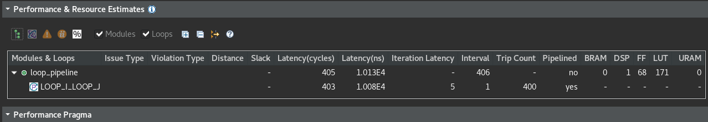
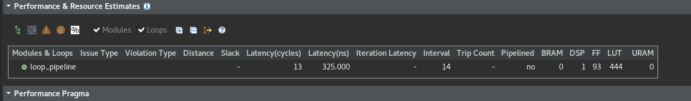
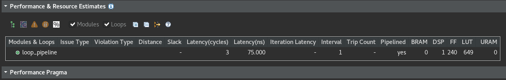

# HLS 循環的寫法

## for loop

```c++
單次循環會把2個變數存到第3個變數 在硬體裡需要3個週期才能完成1次的循環
假設要做20次 就需要 20(次)*3(週期) = 60(時鐘周期) 來完成全部的操作
vadd: for(int i = 0; i < len; i++) { 
   c[i] = a[i] + b[i];
}
// 文件建議:最好用標記來循環 (vadd:…) 此標記有助於在 Vitis HLS 中進行設計優化, 有時未使用的標記在編譯會產生警告, 可忽略此警告
```


Dataflow表面的意思是資料流, 把資料的處理過程像流水線一樣調動起来, 資料一個一個的按照順序輸入, 然後經過處理一個一個的連續輸出, 處理過程盡量不要有中斷

Dataflow使用在函式上, PIPELINE使用在for迴圈上

```c++
vadd: for(int i = 0; i < len; i++) { 
#pragma HLS PIPELINE
c[i] = a[i] + b[i];
}
```

Dataflow循環的啟動時間間隔(Initiation Interval, II) II = 2, 表示循環的下一次迭代會在當前迭代的 2 個週期後啟動 (預設 II = 1 是理想情况)

## PIPELINE 類型


## 流水線的依賴關係

"資料依賴"或"暫存器依賴"的典型用例是在完成上一次讀取或寫入後再次發生讀取或寫入

先寫後讀 (RAW) 操作也叫真性依賴關係, 表示讀取或寫入使用的資料從前一次操作的结果
I1: t = a * b;
I2: c = t + 1;

先讀後寫 (WAR) 操作也叫做反依賴關係, 表示當前指令完成資料讀取後, 下一個指令才能更新寫入
I1: b = t + a;
I2: t = 3;
I2 中的寫入不能在 I1 之前執行, 不然 b 的結果就錯了

先寫後寫 (WAW) 依賴關係表示必須按特定顺序寫入暫存或記憶體, 不然可能破壞結果
I1: t = a * b;
I2: c = t + 1;
I3: t = 1;
I3 中的寫必須晚 I1 中的寫不然, I2 會錯

先讀後讀沒差

## 展開循環

Loop次數的主要是看變數的限制, 也有可能受到循環裡的break之類的影響
展開巡迴, 在 RTL 設計中創建循環主體的多個副本, 從而允許並且執行部分或全部循環 可使用 UNROLL 編譯指示展开循環以便增加資料訪問和吞吐量
默認情况下, HLS 循環保持在收起狀態 (展开的循環的性能顯著高於收起的循環但提升性能的代價是增加面積和資源利用率)

[展開循環](https://docs.xilinx.com/r/zh-CN/ug1399-vitis-hls/%E5%B1%95%E5%BC%80%E5%BE%AA%E7%8E%AF)

## 合併循環

講白了就是把一些不必要的迴圈, 整合成一個。 LOOP_MERGE 最優化指令用於自動合併循環

[合併循環](https://docs.xilinx.com/r/zh-CN/ug1399-vitis-hls/%E5%90%88%E5%B9%B6%E5%BE%AA%E7%8E%AF)

## 處理雙層迴圈

這邊分3種類型的迴圈 完美雙層迴圈 半完美雙層迴圈 不完美雙層迴圈

為了可以有最好效能, 製造完美雙層迴圈就很重要, 完美雙層迴圈有2個條件

1. 循環次數是常量
2. 邏輯描述只在最內層迴圈

```c++
for (i=0;i< const m ;i++) {
   for (j=0;j< const n;j++){
      邏輯放這邊, 然後循環次數都是常量就是完美
   }
}

for (i=0;i< m ;i++) {
   for (j=0;j< const n;j++){
      邏輯放這邊, 然後循環次數 內層是常量 外層是變量 就是半完美
   }
}

for (i=0;i< m ;i++) {
   這邊只要有邏輯 不完美
   for (j=0;j< n;j++){
      只要內層迴圈的循環次數是變量 也是不完美
   }
   這邊只要有邏輯 不完美
}
```

LOOP_FLATTEN 編譯指令會完美跟半完美的迴圈做平鋪, 這樣就不用重新編寫來最優化硬體, 可以減少迴圈裡運算要的周期數

對雙層迴圈做流水打拍優化, 通常可通過對最内層迴圈進行流水打拍來實現面積與性能之間的最優化平衡 這樣同時也可達成最短的運行時間

!!!當迴圈或函數進行流水打拍時, 所在層級比流水打拍的迴圈或函數層級更低的所有迴圈都必須展開!!!

我用範例程式碼來說明:
```c++
dout_t loop_pipeline(din_t A[N]) {

  int i,j;
	static dout_t acc;

	LOOP_I:for(i=0; i < 20; i++){
		LOOP_J: for(j=0; j < 20; j++){
			acc += A[j] * i;
		}
	}

	return acc;
}
```
FF=Flip-flop 正反器

1. 如果對最內層迴圈LOOP_J做流水拍打, 那麼硬體會包含1個LOOP_J的副本(單次乘法), HLS會自動把迴圈平舖, 合併成一個 20*20 的新迴圈(LOOP_I_LOOP_J)這樣只需要做1次的乘法操作跟訪問同一個Array

延遲400個週期 (20x20) 需少於 250 個 LUT 和暫存器(I/O 控制和 FSM 始終存在)


2. 如果對最外層迴圈LOOP_I做流水拍打, 那麼內部的迴圈(LOOP_J)就會展開, 會複製20份主體, 這樣要跑20次乘法和1次的Array訪問, LOOP_I的每次循環都是作为單一實體來處理

延遲13個周期 但需要數百個 LUT 和暫存器 邏輯數量(FF)約為第1個選項的2倍


3. 如果是最頂層做流水拍打那2個迴圈都要展開 這樣需要400次的乘法跟20次的訪問Array 但是這樣的硬體成本超高 要有400個暫存器

由於存在20次並行暫存器訪放 所以延遲只要3個周期 但所需邏輯數量(FF)接近第2個選項的2倍(第1個選項的4倍)


## 處理變量的迴圈

簡單的說就是不要把Loop的次數設定成變量 會很麻煩 應體會不知道怎處理

[官方文件](https://docs.xilinx.com/r/zh-CN/ug1399-vitis-hls/%E5%A4%84%E7%90%86%E5%8F%98%E9%87%8F%E5%BE%AA%E7%8E%AF%E8%BE%B9%E7%95%8C)
