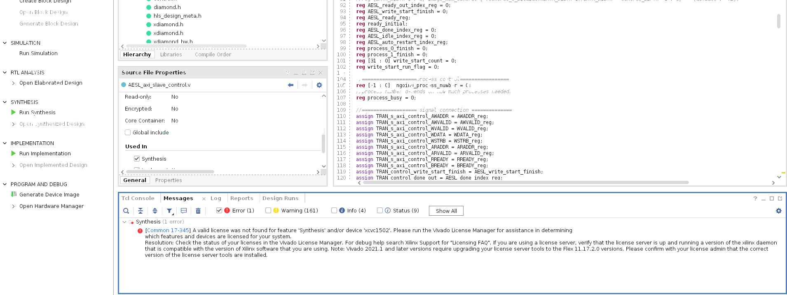
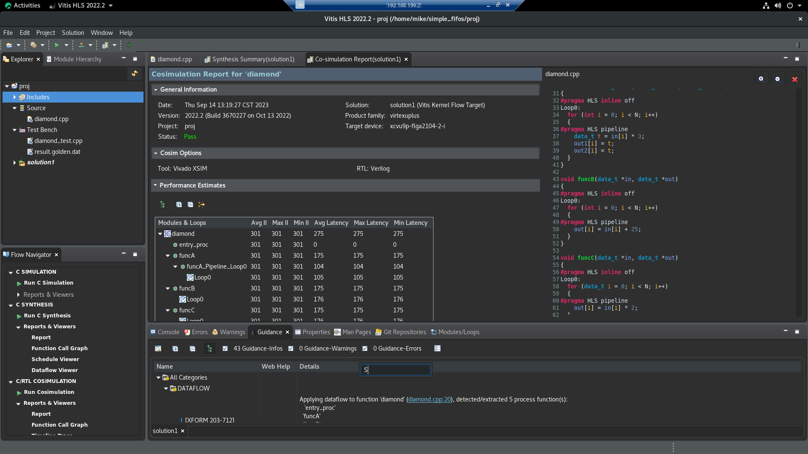

控制驅動的程式和資料驅動的程式, 可以採用程式並行 (TLP) 模型


這個是資料驅動的範本
任務類別(hls::task)和緩衝流類別(FIFO:hls::stream/#pragma HLS STREAM)(PIPO:hls::stream_of_blocks)
```c++
#include "test.h"

void splitter(hls::stream<int> &in, hls::stream<int> &odds_buf, hls::stream<int> &evens_buf) {
    int data = in.read();
    if (data % 2 == 0)
        evens_buf.write(data); //s2通道
    else
        odds_buf.write(data); //s1通道
}

void odds(hls::stream<int> &in, hls::stream<int> &out) {
    out.write(in.read() + 1); //s1通道
}

void evens(hls::stream<int> &in, hls::stream<int> &out) {
    out.write(in.read() + 2); //s2通道
}

void odds_and_evens(hls::stream<int> &in, hls::stream<int> &out1, hls::stream<int> &out2) {
    hls_thread_local hls::stream<int> s1; // channel connecting t1 and t2
    hls_thread_local hls::stream<int> s2; // channel connecting t1 and t3

    // t1 infinitely runs function splitter, with input in and outputs s1 and s2
    hls_thread_local hls::task t1(splitter, in, s1, s2);
    // t2 infinitely runs function odds, with input s1 and output out1
    hls_thread_local hls::task t2(odds, s1, out1);
    // t3 infinitely runs function evens, with input s2 and output out2
    hls_thread_local hls::task t3(evens, s2, out2);
}
```


控制驅動的範本就是上一章的流水拍打

## Vitis HLS的優化有一些規定

1. 沒有關聯性的函數, 裡面沒有變數初始化的設定, 函數之間沒有改同一個值的關係

2. 迴圈 要0開始 每次遞增1 資料流需要在迴圈內 其他跟第1點一樣

在以下的條件下只能照順序把變數A從函數A給到函數B

變數只能包含 1 個讀Process和 1 個寫Process

如果是用函數的參數 寫入步驟要在讀之前

函數迴傳值要空的(void)

## 資料流向檢查

Vitis HLS 具有資料流的检查功能 啟用後可以檢查程式碼 是否符合建議的規範
預設情況下是warning 要改的話可以用以下設定

```txt
config_dataflow -strict_mode  (off | error | warning)
```

## Array指定FIFO/PIPO

- 對於純量 Vitis HLS 會自動使用 FIFO 當通道類型

- 如果是用陣列的方式當參數 可以選擇用哪一個當通道

如果始终照顺序可以用FIFO/PIPO
PIPO 的優勢: PIPO 從不發生死鎖, 但需要耗用更多記憶體
FIFO 的優勢: 要得記憶體少, 但如果 FIFO 大小設計不對, 則存在發生死鎖的可能
如果任意順序訪問 通道必須是 PIPO 默認大小是原始陣列的2倍

```c++
void top ( ... ) {
#pragma HLS dataflow
  int A[1024];
#pragma HLS stream type=pipo variable=A depth=3
//depth參數 在 FIFO 代表大小 在 PIPO 代表深度(塊數)
  
  producer(A, B, …);  // producer writes A and B
  middle(B, C, ...);  // middle reads B and writes C
  consumer(A, C, …);  // consumer reads A and C
```

## 同步的串流

標頭: #include "hls_streamofblocks.h"

宣告: hls::stream_of_blocks<block_type, depth> v

要使用使用 hls::write_lock 或 hls::read_lock 才能訪問該通道

```c++
#include "hls_streamofblocks.h"
typedef int buf[N];
void 生產者 (hls::stream_of_blocks<buf> &s, ...) {
  for (int i = 0; i < M; i++) {
    // 要宣告這個write_lock來寫入buf
    hls::write_lock<buf> b(s);
    for (int j = 0; j < N; j++)
      b[f(j)] = ...;
    // Deallocation of hls::write_lock releases the block for the consumer
  }
}
  
void 消費者(hls::stream_of_blocks<buf> &s, ...) {
  for (int i = 0; i < M; i++) {
    // 要宣告這個read_lock來讀取buf
    hls::read_lock<buf> b(s);
    for (int j = 0; j < N; j++)
       ... = b[g(j)] ...;
    // Deallocation of hls::write_lock releases the block to be reused by the producer
  }
}
  
void 主程式(...) {
#pragma HLS dataflow
  hls::stream_of_blocks<buf> s;
  
  生產者(b, ...);
  消費者(b, ...);
}
```
[using_stream_of_blocks範例](https://github.com/Xilinx/Vitis-HLS-Introductory-Examples/tree/master/Task_level_Parallelism/Control_driven/Channels/using_stream_of_blocks)





