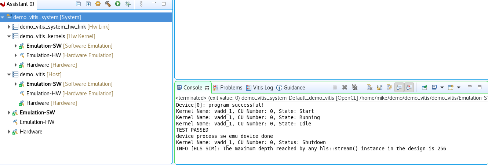

# 總結

Vitis 開發通常把程式碼分成 host code 和 kernel code.
host code 通常是 C/C++ 程式碼並放在板子上的 ARM 核心上執行.
kernel code 通常是 C/C++/HLS/RTL 程式碼，最後變成 PL 硬件，host code 和 kernel code 通過 XRT（Xilinx Runtime）來實現溝通

只要在 Export RTL 的地方選


要改 C++17


[XRT 的文件](https://xilinx.github.io/XRT/master/html/platforms.html)

# U50 設定 Vitis HLS

要讓 Vitis HLS 可以產生 U50 的模組，需要去下載 [Vivado Design Flow](https://www.xilinx.com/products/boards-and-kits/alveo/u50.html#vivado) 裡面的 Board File 然後解壓縮丟到 /data/tools/Xilinx/Vivado/2022.2/data/xhub/boards/XilinxBoardStore/boards/Xilinx

指令:
```bash
cp -r  au50/ /data/tools/Xilinx/Vivado/2022.2/data/xhub/boards/XilinxBoardStore/boards/Xilinx
```

# 用 Vitis 開發

可以用範例的 Hello Word 來驗證

1. 要先點 Hardware 的 build

2. Emulation-SW 也要 build

3. 就可以 run 了



[Hello Word](https://zhuanlan.zhihu.com/p/660328925)
[說明](https://blog.csdn.net/Zhu_Zhu_2009/article/details/109039313)

# XDC 約束文件 (Vivado 的)

XDC File 是用在 Vivado 裡的 加在


<!--
當開始使用 Vivado 設計工具時，我遇到了同樣的問題。在網路上看了很多資料後，我意識到電纜驅動程式沒有正確安裝。解決方案非常簡單：
/data/tools/Xilinx/Vivado/2022.2/data/xicom/cable_drivers/lin64/install_script/install_drivers on ⎇   $ sudo ./install_drivers
/data/tools/Xilinx/Vivado/2022.2/data/xicom/cable_drivers/lin64/install_script/install_drivers on ⎇   $ sudo ./install_drivers
-->