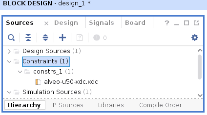

# U50 設定

要讓 Vitis HLS 可以產生 U50 的模組，需要去下載 [Vivado Design Flow](https://www.xilinx.com/products/boards-and-kits/alveo/u50.html#vivado) 裡面的 Board File 然後解壓縮丟到 /data/tools/Xilinx/Vivado/2022.2/data/xhub/boards/XilinxBoardStore/boards/Xilinx

指令:
```bash
cp -r  au50/ /data/tools/Xilinx/Vivado/2022.2/data/xhub/boards/XilinxBoardStore/boards/Xilinx
```

# XDC 約束文件

XDC File 是用在 Vivado 裡的 加在



<!--
當開始使用 Vivado 設計工具時，我遇到了同樣的問題。在網路上看了很多資料後，我意識到電纜驅動程式沒有正確安裝。解決方案非常簡單：
/data/tools/Xilinx/Vivado/2022.2/data/xicom/cable_drivers/lin64/install_script/install_drivers on ⎇   $ sudo ./install_drivers
/data/tools/Xilinx/Vivado/2022.2/data/xicom/cable_drivers/lin64/install_script/install_drivers on ⎇   $ sudo ./install_drivers
-->