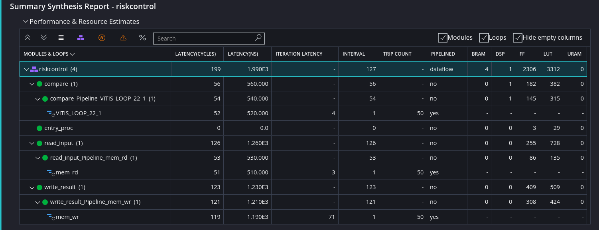
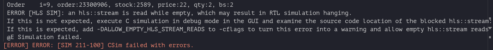

# 報告 2.0

根據上次的專案 整理一下所需的資源



我本來的想法 是想用非同步的方式讀取通道內的資料 讀出來就處理 不用 For 迴圈的方式一筆一筆拿 應該可以加快流程

但是研究發現下去 好像有點不一樣

嘗試使用非同步的方式讀取資料 會出現一些問題

在C SIMULATION 會遇到錯誤 可以在 cflages 加入 -DALLOW_EMPTY_HLS_STREAM_READS 就可以變警告



```
ERROR [HLS SIM]: an hls::stream is read while empty, which may result in RTL simulation hanging.
當警告處理後
```

在 C SYNTHESIS 會有

```
[ERROR] ERROR: [XFORM 203-123] Cannot stream  'customers_out': the stream channel does not have data producer function.
[ERROR] ERROR: [HLS 200-1715] Encountered problem during source synthesis
[ERROR] ERROR: [HLS 200-70] Pre-synthesis failed.
```

非同步處理的 Code

```c++
// 判斷
static void compare(int *initdata, hls::stream<order_t> &inStream, hls::stream<int> &outStream, int order_record)
{
execute:
    int money = 0;
    int i = 0;
    int check = 0;
    int index;
    while (check != 0)
    {
        if (!inStream.empty())
        {
            order_t order;
            if (inStream.read_nb(order))
            {
                //order_t order = inStream.read();
                // printf("資料: [%d] \n", order);
                stock_t tempstock = order(stock_len + price_len + qty_len + bs_len - 1, price_len + qty_len + bs_len);
                // printf("stock: [%d] \n", tempstock);
                price_t tempprice = order(price_len + qty_len + bs_len - 1, price_len);
                // printf("price: [%d] \n", tempprice);
                qty_t tempqty = order(qty_len + bs_len - 1, qty_len);
                // printf("qty: [%d] \n", tempqty);
                bs_t tempbs = order(bs_len - 1, 0);
                // printf("bs: [%d] \n", tempbs);
                money = tempqty * tempprice * 1000;
                // printf("money: [%d] \n", money);
                if (i == 0 || i == 1 || i == 2 || i == 3 || i == 4 || i == 5 || i == 6 || i == 7 || i == 8 || i == 9)
                    printf("dataassign i=%d 資料: [%d] stock: [%d] price: [%d] qty: [%d] bs: [%d]\n", i, order, tempstock, tempprice, tempqty, tempbs);

                if (tempbs == 1) // 買單檢查額度
                {
                    use_amt += money;
                    printf("單筆價金 i=%d 已用投資額度 i=%d \n", money, use_amt);
                    if (5000000 < use_amt)
                        outStream.write(1);
                    else
                        outStream.write(0);
                }
                else if (tempbs == 2) // 賣單檢查庫存
                {
                    if (initdata[i] < tempqty)
                        outStream.write(1);
                    else
                        outStream.write(0);
                }
                else
                {
                    outStream.write(0);
                }
            }
        }
        check = 1;
    }
}
```
