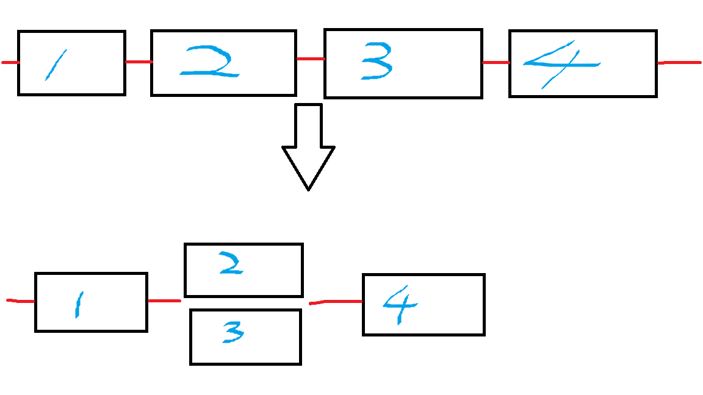
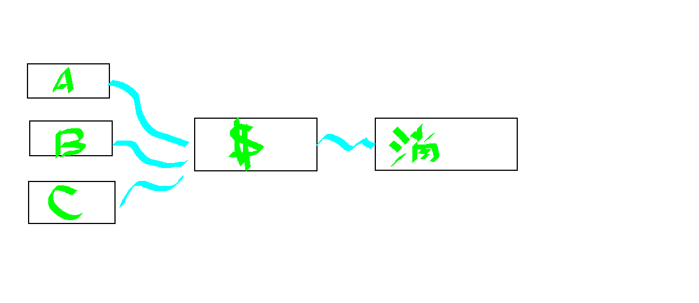
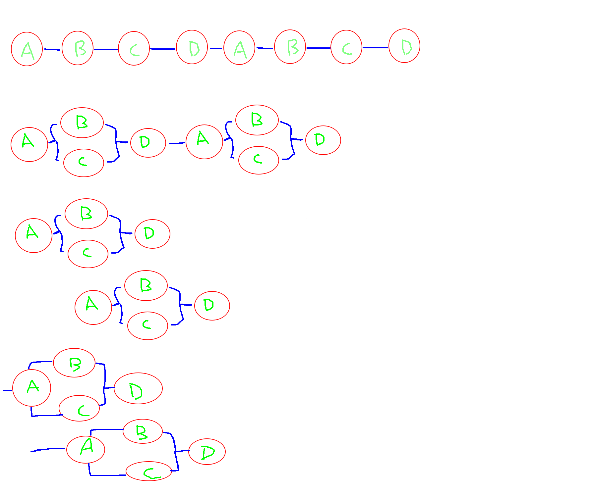
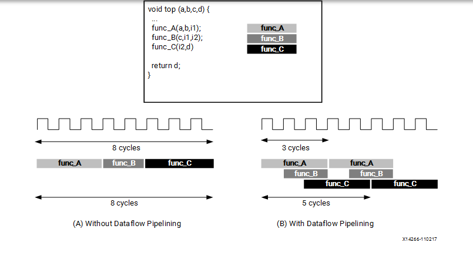
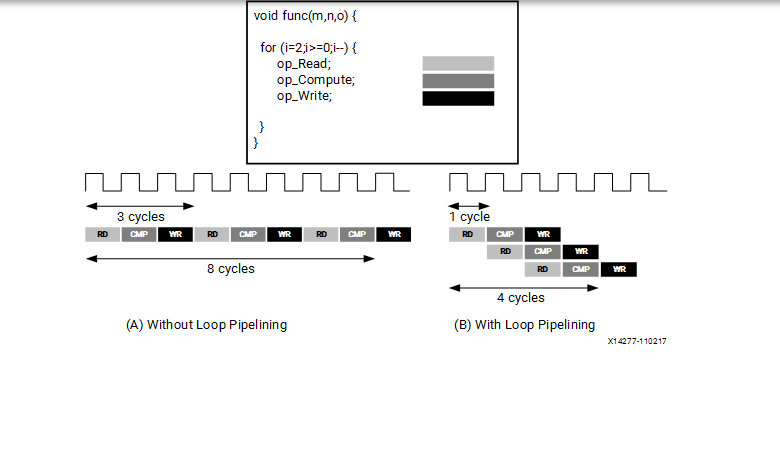

# 設計原則

Throughput：吞吐量定義單位時間內做特定的事情或是單位時間內產生多少結果

Memory bandwidth：記憶體頻寬是處理器可以從記憶體讀取資料或將資料儲存到記憶體的速率。

例如，一個電腦有兩個通道的記憶體，每通道都配備執行在400MHz時脈頻率的DDR2-800模組，則其理論最大記憶體頻寬為：
每秒400,000,000個時鐘×每個時鐘2個通道×每行64個位×2個介面=
每秒102,400,000,000（1024億）位元（也就是12,800MB/s或12.8GB/s）
但是該理論最大記憶體頻寬被稱為「突發速率」，是不可持續的。

就是想辦法越快越好。

等等要說的概念都是從大到小，從一個問題延伸出對應的想法。

# FPGA 程式設計的三大觀念

## Producer-Consumer Paradigm (生產者消費者問題)

我對生產者消費者問題的理解如下：

（可以把倉庫當一個緩衝區）

通常是指說倉庫大小為N，生產者把東西放到倉庫，消費者把東西從倉庫拿走。

互斥關係：對倉庫的訪問需要互斥，包括生產者和生產者之間、消費者和消費者之間、生產者和消費者之間。
同步關係：當倉庫滿的時候生產者需要等待，當倉庫空的時候消費者需要等待。

對 C++ 來說就是多執行緒的同步經典問題。

當然還有，單一生產者-多消費者模型，多生產者-單一消費者模型，多生產者-多消費者模型。

所以這題目對 FPGA 來說就是，我們寫程式的人要自己控管那些部分可以是被平行處理，不用上鎖的，哪些是要照順序處理的。

這邊我用單一生產者-單一消費者模型舉例說明：

當我要把產品放到倉庫，需要幫商品標好價錢。我可以先標好價錢再放到倉庫，這 2 件事情是不衝突的。



## Streaming Data Paradigm

Streaming （流）是比較抽象的概念，就是無限制的連續更新資料，其中“無限制”表示“大小未知或者大小無限”的資料。

生產者跟消費者之間的資料傳遞可以是流。

原文：

```txt
In software, random memory accesses to data are virtually free (ignoring the caching costs), but in hardware, it is really advantageous to make sequential accesses, which can be converted into streams.
```

在軟體設計中對記憶體裡的資料做隨機存取的代價很低也很快，但是硬體裡做順序存取是很棒的一件事，可以轉換成流的形式。

這邊用上面的例子來說明，假設多個產品要放到倉庫，但是都要標好價錢，如果採取單一生產者的方式會比較慢。

這邊的 A、B、C 商品，都需要標好價錢可以用流的方式給標價錢的任務，只要標價錢任務有辦法承受那些流量，就可以處理多種商品。



這邊有提到 2 個流傳輸的模式 FIFO 或 PIPO 這邊就先帶過處理。

這邊的理念就是，我們只需要專注在每個任務上，任務跟任務之間都用流溝通，然後不同的流之間還可以達到異步緩衝的功能。

當然也可以用流來幫我們的系統做分層。

## Pipelining Paradigm

這邊先說工業裡的流水線設計，因為概念是類似的，或者應該說是參考工業的設計！

最主要精神在於「讓某一個生產單位只專注處理某一個片段的工作」，而非傳統的讓一個生產單位從上游到下游完整完成一個產品。

假設裝配一輛汽車需要4個步驟：
1.衝壓：製作車身外殼和底盤等部件；

2.焊接：將衝壓成形後的各部件焊接成車身；

3.塗裝：將車身等主要部件清洗、化學處理、打磨、噴漆和烘乾；

4.總裝：將各部件（包括髮動機和向外採購的零部件）組裝成車；

同時對應地需要衝壓、焊接、塗裝和總裝四個工人。採用流水線的製造方式，同一時刻四輛汽車在裝配。

如果不採用流水線，那麼第一輛汽車依次經過上述四個步驟裝配完成之後，下一輛汽車才開始進行裝配，最早期的工業製造就是採用的這種原始的方式。未採用流水線的原始製造方式，同一時刻只有一輛汽車在裝配。

不久之後就發現，某個時段中一輛汽車在進行裝配時，其它三個工人處於閒置狀態，顯然這是對資源的極大浪費。

於是開始思考能有效利用資源的方法：在第一輛汽車經過沖壓進入焊接工序的時候，立刻開始進行第二輛汽車的衝壓，而不是等到第一輛汽車經過全部四個工序後才開始。

之後的每一輛汽車都是在前一輛衝壓完畢後立刻進入衝壓工序，這樣在後續生產中就能夠保證四個工人一直處於運行狀態，不會造成人員的閒置。

這樣可以提高單位時間的生產量。

# 程式碼

```c++
void diamond(data_t vecIn[N], data_t vecOut[N])
{
    data_t c1[N], c2[N], c3[N], c4[N];
    #pragma HLS dataflow
    A(vecIn, c1, c2);
    B(c1, c3);
    C(c2, c4);
    D(c3, c4, vecOut);
}
```

假設是在 C++ 下，一定是照順序做。

下面 B 跟 C 沒有直接關係可以並行處理。

然後第二個 A 又可以在第一個 B 和 C 做的時候又開始 (流水線功能)。

還可以把單次循環中把 A 的資料用流的方式放入到流水線中。

```txt
最後一張圖的說明，要讓 A B C 在同一個循環中，只能用流的方式，當然 D 也可以跟 B C 放放在一起，但是要注意死鎖的情況。
This last type of overlap within a run can be achieved if A communicates to B and C through FIFO streaming accesses (represented as lines without circles). Similarily, D can also be overlapped with B and C, if the channels are FIFOs instead of PIPOs. However, unlike all previous execution patterns, using FIFOs can lead to deadlocks and so these streaming FIFOs need to be sized correctly.
```



# 總結

- 設計的架構最好是朝著生產者消費者問題來處理。

- 附上原文 As a general rule, the HLS compiler only infer task-level parallelism from function calls. Therefore, sequential code blocks (such as loops) which need to run concurrently in hardware should be put into dedicated functions.

- HLS 編譯器會從函數的呼叫來推斷任務層的並行性。因此，需要在硬體中需要併發執行的順序程式碼區塊（例如循環）應該放入專用函數中。

- 原始的演算法分成更小的模組，這些模組可以通過串流來溝通，這樣我們可以掌握資料的流動方式。

- 較小的模組的優點是，可以在需要的時候複製用來提高並行性。

- 避免使用太寬的位元，比較小的寬度有利於在 FPGA 上實現。

- 大型函數可能有較複雜的邏輯，這些邏輯可能會造成電路很難處理，更小的功能更簡單的邏輯有利於在 FPGA 上實現。

- 目標是在每個函數內具有單一循環巢狀（具有可由 HLS 工具推斷的固定循環邊界，或透過手動向 HLS 工具提供循環行程計數資訊）。這極大地方便了吞吐量的測量和最佳化。雖然這可能不適用於所有設計，但對於大多數情況來說這是一個好方法。

- 吞吐量的優化要注意流的大小跟找對關鍵的地方使用，可以透過HLS GUI 工具來檢視。

- 考慮同步的問題，使用 PIPO 通道可以重疊任務執行而不必擔心死鎖，而明確手動串流 FIFO 通道可以更快地開始重疊執行（比 PIPO 更早），但需要仔細調整 FIFO 大小以避免死鎖。

說那麼多，這些東西都是為了提高效率的方法，並行處理、異步的 I/O 等等方式。

我們只要想辦法讓系統的順序、資源、並行性，都是合理範圍就好。

後面放了蠻多 CPU 流水線的文章，因為跟 FPGA 的 DATAFLOW 概念蠻類似的。

# 實做上要注意的事情

[官方說明-DATAFLOW編譯選項](<https://docs.amd.com/r/en-US/ug1399-vitis-hls/pragma-HLS-dataflow>)

DATAFLOW 支援函數跟函數之間，允許函數和循環在其操作中重疊，從而提高 RTL 實現的並發性並提高設計的整體吞吐量。

所有操作均在 C 描述中依序執行。在沒有任何限制資源的指令（例如 pragma HLS 分配）的情況下，Vitis HLS 工具力求最大限度地減少延遲並提高並發性。然而，數據依賴性可能會限制這一點。例如，存取數組的函數或循環必須完成所有讀取。

指定 DATAFLOW 後，HLS 工具會分析順序函數或循環之間的資料流，並建立通道（基於乒乓 RAM 或 FIFO），允許消費者函數或循環在生產者函數或循環完成之前開始操作。這允許函數或循環並行運行，從而減少延遲並提高 RTL 的吞吐量。

如果未指定啟動間隔（一個函數或循環啟動與下一個函數或循環之間的週期數），HLS 工具會嘗試最小化啟動間隔，並在資料可用時立即開始操作。

為了讓資料流優化可以使用，資料必須在設計中從一個任務流向下一個任務，以下寫法會使 DATAFLOW 失敗

- 單一生產者消費者有不合法的行為

- 函數之間有回傳

- 函數是有條件執行的

- 循環裡面有多個退出條件

很常搞混的 pipeline 選項

[官方說明-pipeline編譯選項](<https://docs.amd.com/r/en-US/ug1399-vitis-hls/pragma-HLS-pipeline>)

透過允許並發執行操作來減少函數或循環的啟動間隔（II）。

看圖說故事



# 參考文獻

[維基百科-工業流水線](<https://zh.wikipedia.org/zh-tw/%E8%A3%9D%E9%85%8D%E7%B7%9A>)

[維基百科-pipeline](<https://zh.wikipedia.org/wiki/%E6%B5%81%E6%B0%B4%E7%BA%BF_(%E8%AE%A1%E7%AE%97%E6%9C%BA)>)

[cpu流水線](<https://baike.baidu.hk/item/cpu%E6%B5%81%E6%B0%B4%E7%B7%9A/4421101>)

[计算机体系结构——流水线技术（Pipelining）](<https://www.cnblogs.com/CorePower/p/CorePower.html>)

[流水線技術](<https://baike.baidu.hk/item/%E6%B5%81%E6%B0%B4%E7%B7%9A%E6%8A%80%E8%A1%93>)

[深入淺出CPU流水線工作原理](<https://www.zhaixue.cc/weixin/weixin-cpu-pipeline.html>)