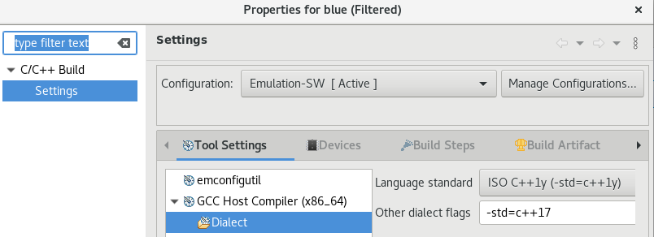
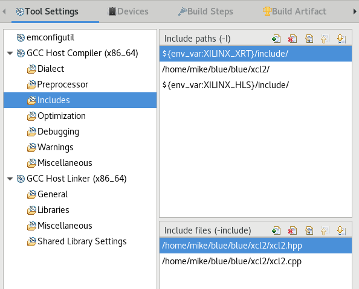
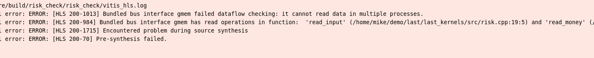

xcl2.hpp 主要包含以下幾個方面的內容：

封裝的 OpenCL 函數：這些函數封裝了標準 OpenCL API 調用，使得開發者能夠以更簡潔的方式進行編程。例如，它提供了簡化的方法來創建和管理 OpenCL 對象，如內存緩衝區、設備、隊列等。

錯誤處理：它包含了一套錯誤處理機制，當 OpenCL API 調用失敗時能夠提供更清晰的錯誤信息。

內存對齊分配器：如你之前所提到的，它包含了特殊的分配器 aligned_allocator，用於確保數據適當地對齊以符合 FPGA 的要求。

小坑
