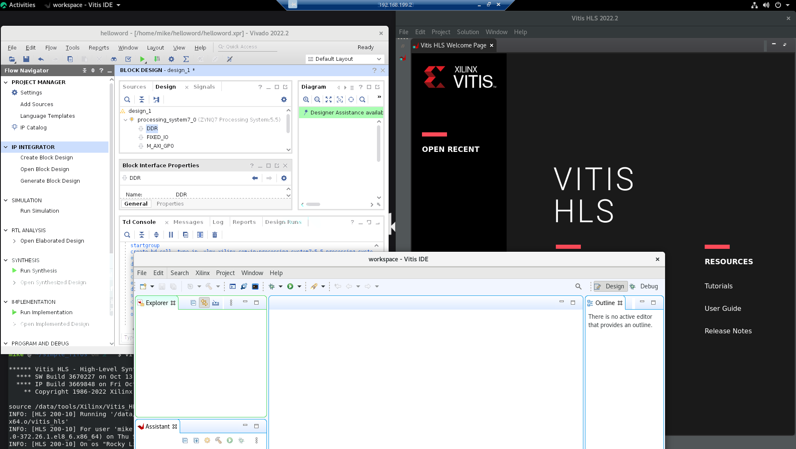

# Xilinx 工具差異

PL = programmable logic. = 可編程邏輯
HDL = 硬體描述語言 (Verilog 或 VHDL 文件就對了)
IP塊 = 軟體當中的函式庫 C++的atol()之類的
## 硬體

Vivado是硬體平台處理HDL或是IP塊, 代表只可以處理PL的部分

## 中間件

Vitis HLS（High Level Synthesis）是為PL開發IP塊, 作為VHDL和Verilog的替代方案或是補充方案
甚至可以加載到 Vivado 中進行手動優化

## 軟體

Vitis 是針對處理器的軟體開發 C 和 C++ 語言
