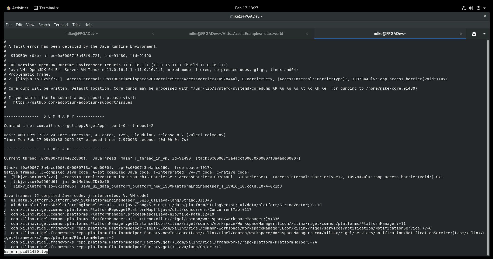
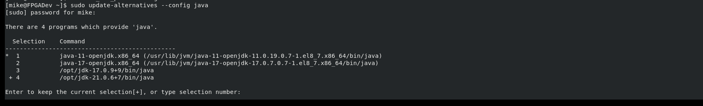
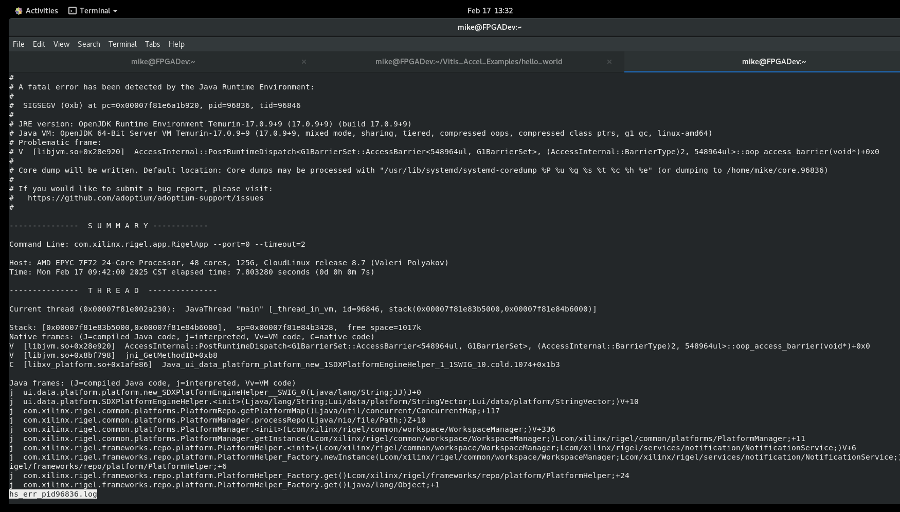
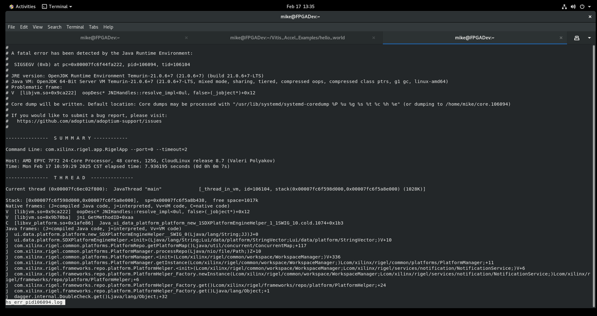
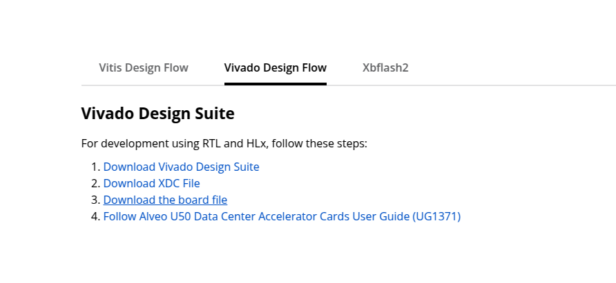
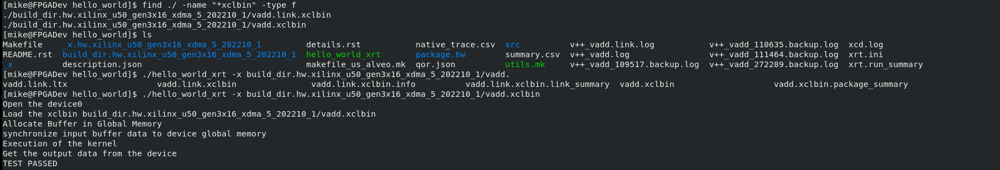

# 問題8.7版本的Linux可不可以支持2023.2的版本 先說結論 可以

## 遇到第一個問題就是 Vitis IDE 開不起來



Log 是寫 JAVA 有問題所以我去更新系統的 JAVA 版本 (17跟21)



這邊有個坑 當我更新後 他啟動還是用11版本的 要手動去改他的啟動腳本

```bash
1. 編輯 vitis 腳本
nano /tools/Xilinx/Vitis/2023.2/bin/vitis
找到：
export JAVA_HOME=$XILINX_VITIS/tps/lnx64/jre11.0.16_1/
改成：
export JAVA_HOME=/opt/jdk-17.0.9+9 或 21

2. 編輯 vitis-server 腳本
nano /tools/Xilinx/Vitis/2023.2/bin/vitis-server
找到：
export JAVA_HOME=$XILINX_VITIS/tps/lnx64/jre11.0.16_1/
改成：
export JAVA_HOME=/opt/jdk-17.0.9+9 或 21

source /tools/Xilinx/Vitis/2023.2/bin/vitis
source /tools/Xilinx/Vitis/2023.2/bin/vitis-server
```

但是 17 版本也有問題就又去更新變成最新的21

因為這篇討論跟我蠻類似的 他用21版本的就正常 (https://adaptivesupport.amd.com/s/question/0D54U00008q9MkNSAU/vitis-20232-does-not-produce-a-xilinxvitis-folder-nor-does-it-launch-using-terminal?language=en_US)



結論是21也不行



## 第2個問題缺少平台檔案

要先去 https://www.amd.com/en/products/accelerators/alveo/u50/a-u50-p00g-pq-g.html#vivado



下載後解開壓縮丟到/tools/Xilinx/Vivado/2023.2/data/xhub/boards/XilinxBoardStore/boards/Xilinx

## 最後我用手動編譯的方式處理

先git clone https://github.com/Xilinx/Vitis_Accel_Examples.git 然後切到 2023.2 的分支

去 hello_world 的資料夾要記得改 Makefile 裡面的 PLATFORM ?= xilinx_u250_gen3x16_xdma_4_1_202210_1 改成 PLATFORM ?= xilinx_u50_gen3x16_xdma_5_202210_1 執行 make all

好讀版

```bash
git clone https://github.com/Xilinx/Vitis_Accel_Examples.git
git check out 2023.2
cd hello_world
vi Makefile
#PLATFORM ?= xilinx_u250_gen3x16_xdma_4_1_202210_1
PLATFORM ?= xilinx_u50_gen3x16_xdma_5_202210_1

make all

./hello_world_xrt -x build_dir.hw.xilinx_u50_gen3x16_xdma_5_202210_1/vadd.xclbin
```




