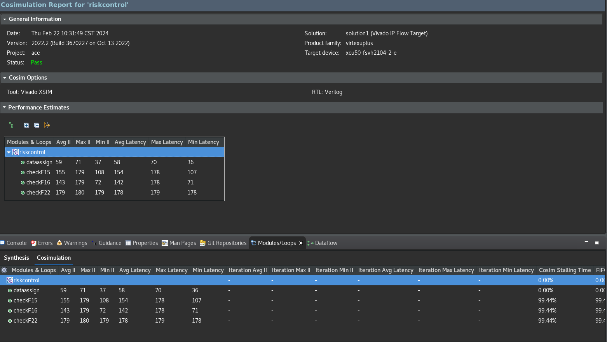
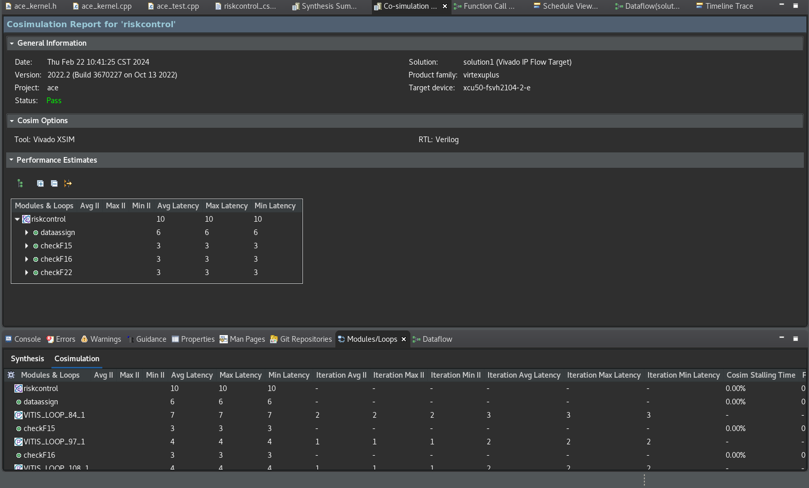
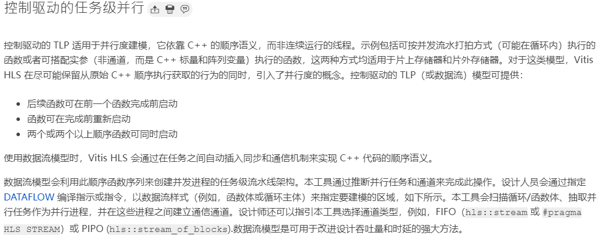
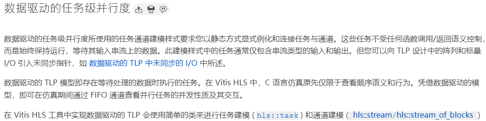
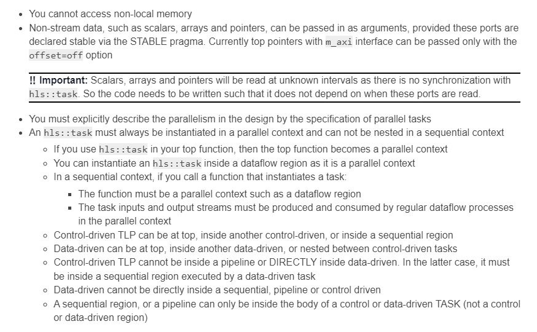
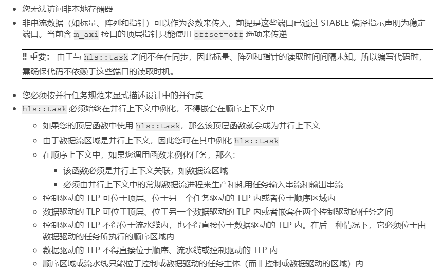

# 介紹

Vitis HLS 2022.2 新增了 hls::task

我的想法是把風控併發一起做，反正先試試看

## 比對

TASK 版本的 C/RTL Cosimulation



DATAFLOW 版本的 C/RTL Cosimulation



## 文獻

[DATAFLOW 跟 Task 比對](https://cloud.tencent.com/developer/article/2313817)

[UG1399 的 Task 說明](https://docs.xilinx.com/r/en-US/ug1399-vitis-hls/HLS-Task-Library)

# 整理

這邊提一下 2 種 Models 控制驅動 (Control-Driven) 和 資料驅動 (Data-Driven)

依照 Vitis 的定義, 控制驅動是依照 C++ 的順序語意, 然後 Vitis HLS 會盡可能保留原本的順序, 再引入並行的概念



資料驅動就是只有 stream 類型的輸入和輸出, 這個函式庫 hls::task 提供一種簡單的方法來建立 Data-Driven



原 DATAFLOW 模型可讓寫入順序函數, 然後 Vitis HLS 自己會分析並且做出默認的優化行為
[默認優化](https://cloud.tencent.com/developer/article/2197424)

使用 Task 可以很簡單的建立資料驅動的模組, 但是只支持串流 I/O 的格式 (hls::stream 或 hls::stream_of_blocks)
當然也有一些限制





上圖說差異

```C++
#include "hls_task.h"

// 外部讀寫是需要靠控制 所以是 I/O 的 DATAFLOW 過程
void write_out(int* out, int n, hls::stream<int> &s2) {
    for (int i=0; i<n; i++)
        out[i] = s2.read();
}
// 外部讀寫是需要靠控制 所以是 I/O 的 DATAFLOW 過程
void read_in(int* in, int n, hls::stream<int> &s1) {
    for (int i=0; i<n; i++)
        s1.write(in[i]);
}
// 這就是任務
void func1(hls::stream<int> &s1, hls::stream<int> &s3) {
    // 這邊不用 for loop 讀取, 因為是任務流
    s3.write(... + s1.read());
}
// 這就是任務
void func2(hls::stream<int> &s3, hls::stream<int> &s2) {
    // 這邊不用 for loop 讀取, 因為是任務流
    s2.write(... * s3.read());
}

// 頂層函數
void top-func(int *in, int *out, int n) {
#pragma HLS dataflow
    hls_thread_local hls::stream<int> sk3;
    hls_thread_local hls::stream<int> sk1;
    hls_thread_local hls::stream<int> sk2;

    read_in(in, n, sk1); // 可以存取 流, array, 純量 但是 呼叫的順序很重要
    hls_thread_local hls::task t2(func2, sk3, sk2); // 只能存取資料流 順序不重要
    hls_thread_local hls::task t1(func1, sk1, sk3); // 只能存取資料流 順序不重要
    write_out(out, n, sk2); // 可以存取 流, array, 純量 但是 呼叫的順序很重要
}
```

說到底這 2 種方法都是針對並行處理所使用的, 只是一個是在控制驅動一個是在資料驅動, 可以在控制驅動底下加入資料驅動, 但是要在資料驅動底下加入控制驅動就不行


