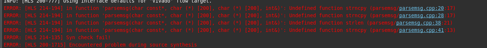
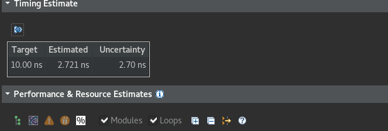
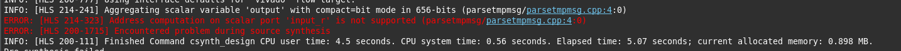
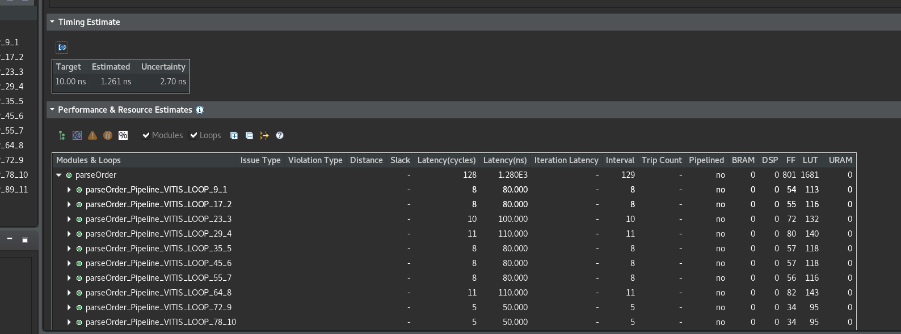
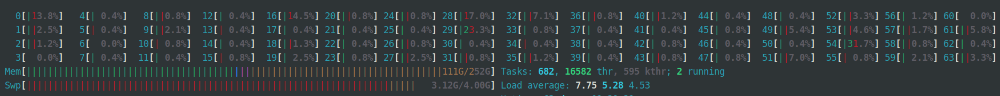
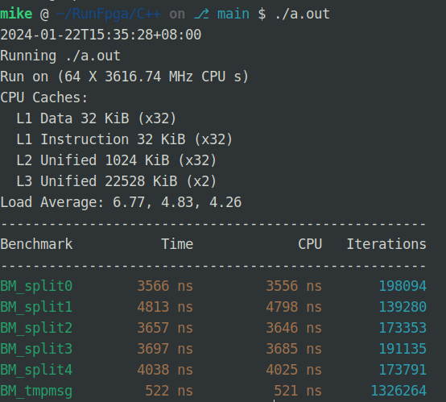

# HLS 解析字串

使用 HLS 來解析字串順便跟軟體的解析來做 benchmark

最大採坑點 HLS 不支援字串的操作

所以 strncpy strlen 等等操作都需要額實作

實作後的延遲也蠻高的

TMP 版本 HLS 綜合有問題

這個錯誤提示是關於輸入端口的問題 HLS 提到了 'input_r'，这可能是 HLS 工具為輸入 input 自動生成的一種内部表示 在硬體設計中，HLS 可能無法處理對指標的計算

C++ 軟體的測試

Time 就是執行的平均耗时, Iterations 是執行的次數
每個測試案例都是跑相同時間的, 所以 Time 和 Iterations 是基本成反比的, 執行一次的時間越短, 同樣時間內能執行的次數就越多

我是用 235 來跑的

